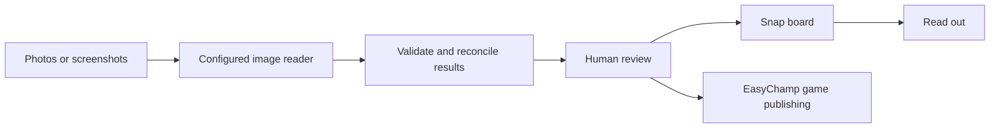

# Snap to League

**Your results are on paper. Give them a place people can follow.**

Snap to League imports photos of scoresheets, whiteboards and brackets, or screenshots of results. Review the extracted teams and scores, correct mistakes, then publish supported game competitions through [EasyChamp](https://easychamp.com). Placement-based contests have their own shareable Snap board.

[Try the demo](https://snap.easychamp.com) · [Watch the 110-second demo](https://www.youtube.com/watch?v=KYboiI2Xmfw) · [Submission draft](docs/DEVPOST.md) · [Campaign assets and release status](docs/campaign/RELEASE.md)

Built for ShellHacks 2026. **EasyChamp is a pre-existing platform**; this project adds photo import, review, reconciliation and its publishing integration. The current public demo runs through a Cloudflare Worker and a tunnel to a development Mac. Availability depends on that host and tunnel; this is a hackathon demo.

## The workflow

1. Add a photo or a set of photos. Choose a sample to explore without an account.
2. Review teams, games and scores. The app recomputes standings from match results and flags inconsistencies. Configured readers can compare their extractions; a second opinion is optional and can fail independently.
3. Correct the draft. Additional photos can be compared with the current draft or a saved competition; inspect proposed changes before saving.
4. Sign in with EasyChamp to publish supported game competitions into your account. Podiums remain on Snap.

| Input | Result | Publishing scope |
|---|---|---|
| Match scores and group-stage results | Reviewed matches and computed standings | EasyChamp game competitions |
| Knockout results | Reviewed games, advancement and bracket | EasyChamp game competitions |
| Races, trivia and cup-stacking results | Placement or points leaderboard | Shareable Snap board; no EasyChamp placement-stage publishing |

Cropped scores, handwriting, similar names and ambiguous formats need review. Sample boards contain demo data.

## Voice and technology

**Read out** speaks standings through ElevenLabs when configured, with browser speech as a fallback. The filmed demo shows this on-demand feature. An opt-in announcer for changed matches is implemented separately; automatic playback has not been verified across browsers.

FastAPI handles jobs, Pydantic validates extraction, and application code computes standings and reconciles names. Gemini can read images through Google's API; the actual import identifies its reader. Storage defaults to local JSON, with an optional MongoDB adapter.



## What existed before the event

| Existing component | How this project uses it |
|---|---|
| EasyChamp identity, league import and competition sites | Sign-in and destination for supported game competitions |
| EasyChamp Matchday design tokens | Interface styling |
| FastAPI, Pydantic and other dependencies in `pyproject.toml` | Application framework and validation |
| Gemini and other configured model APIs; ElevenLabs | Image extraction and optional speech services |

This repository's history begins September 26, 2026, at `b079e20`. EasyChamp and the dependencies above predate the event. See the [rules and challenge notes](docs/campaign/RULES-AND-CHALLENGES.md).

## Run locally

```bash
uv venv .venv --python 3.12
uv pip install --python .venv/bin/python -e '.[dev,mongo]'
cp .env.example .env
.venv/bin/uvicorn app.main:app --host 127.0.0.1 --port 8077
```

Set provider credentials in the ignored `.env` file, or use `SNAP_BACKEND=fixture` for offline sample output. The unconfigured backend can try the local Codex CLI and then Gemini when available; explicitly select a backend for reproducible runs.

Open [localhost:8077](http://localhost:8077). Phone access requires a network-accessible bind address. The `edge/` Worker forwards the public hostname to a tunnel; quick-tunnel addresses change on restart.

Publishing uses EasyChamp sign-in and a server-side identity check. `EC_PUBLISH=1` enables external publishing; otherwise the integration returns a dry-run payload. Operator scripts have a separate PIN/service-account path. Keep sample evaluation in dry-run mode.

## Validation and evidence

```bash
.venv/bin/python -m pytest -q
```

[Evidence notes](docs/campaign/EVIDENCE-AND-CLAIMS.md) separate implementation, recorded demos and current checks. Historical benchmark tables are fixture results, not current accuracy, speed or cost guarantees. No fixed test count is claimed here.

| Path | Purpose |
|---|---|
| `app/extract.py`, `app/jobs.py` | Readers, optional comparison and photo jobs |
| `app/merge.py`, `app/standings.py`, `app/ranking.py` | Reconciliation, standings and placement ranking |
| `app/auth.py`, `app/easychamp.py` | EasyChamp sign-in and publishing |
| `app/safety.py`, `app/store.py` | Request limits, image checks and storage |
| `static/` | Import/review interface and shared boards |
| `edge/` | Public Worker proxy |
| `docs/campaign/` | Challenge fit, campaign copy and release checklist |

Image validation and request limits are implemented. Upload only information you can share; saved boards are designed for sharing.
