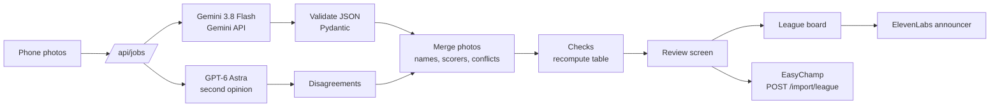

# Snap to League

**Photo of the board. Live league in seconds.**

Take a phone photo of a tournament whiteboard, a paper scoresheet, a bracket, or a screenshot from another app. Snap to League reads every result, checks the numbers, lets you fix anything it doubted, and publishes a live league with standings or a bracket on [EasyChamp](https://easychamp.com). The next photo updates the same league.

Live: **https://snap.easychamp.com** · Built at ShellHacks 2026.

## Why

Most amateur tournaments (pickup soccer, rec leagues, school intramurals, gaming nights, bar leagues) still run on whiteboards, paper and group chats. League platforms only import CSV files, so organizers would have to retype everything, and they don't. We found no product that turns a photo into a live league page ([competitors](docs/MARKETING.md#competitors)).

## What it does

- **Several photos at once.** Every page of a tournament, read in parallel, with upload and reading progress per photo.
- **Two AI readers.** Gemini 3.8 Flash reads each photo through Google's Gemini API; GPT-6 Astra reads it at the same time. Where they disagree on a result, the organizer gets a card to check. The organizer can pick the main reader, including open-weight models (GLM 5.3 Flash, Qwen 3.8 Flash).
- **Checks that never trust the model.** The standings are recomputed from the results. Duplicate team spellings, games marked played without a score, a final that contradicts the table, and photos that disagree on a result are all flagged.
- **Merging and updates.** The same team written two ways becomes one team. Scorers are attached to their games. A newer photo of the same board updates the league and shows exactly what changed (added, result, changed from 4-2 to 4-3).
- **Any format it sees.** Group tables, knockout brackets (quarterfinal to final), scorers from scoresheets, standings-only screenshots, and screenshots from Challonge, start.gg, Score7 and LeagueRepublic.
- **Publish to EasyChamp.** A real league site with standings or a bracket, rosters and goal events, created through EasyChamp's league import. Sport or game is detected (soccer, futsal, Smash, FIFA...).
- **Announcer.** A league board left on a TV reads every new result out loud with an ElevenLabs voice.
- **Guest mode.** No sign-up to read, review and share a board. Past imports are kept on the device; the stats page shows every import.

## Results

| Test | Result |
|---|---|
| Handwritten group board (synthetic) | 7 of 7 games, correct table, flagged a final that contradicts the table |
| Handwritten 8-player bracket (synthetic) | 7 of 7 games, published as quarterfinals, semifinals and final |
| Two scoresheets a week apart (synthetic) | 4 games with 16 scorers merged in 8.3 s; misspelled "Sharcs" flagged |
| Real Challonge bracket screenshot | 8 of 8 results |
| Real start.gg pool screenshot | 20 of 22 results (2 cut off or misread) |
| Real Score7 group and knockout screenshots | 9 of 9 results |
| Real start.gg and LeagueRepublic standings | 30 of 30 rows, in order |

Ground truth for the real screenshots was read from each page's HTML, not the image (`tests/fixtures/external/*.truth.json`, `scripts/eval_external.py`). Model comparison: `scripts/bench.py`, table in [docs/ARCHITECTURE.md](docs/ARCHITECTURE.md#models-and-cost).

## How it works



Details: [docs/ARCHITECTURE.md](docs/ARCHITECTURE.md) · JSON format, validation, merging: [docs/JSON.md](docs/JSON.md) · Marketing: [docs/MARKETING.md](docs/MARKETING.md)

## Safety

- API keys live only in the server's `.env` (git-ignored). The browser never sees them; responses and logs never include them.
- Photos must open as images (JPEG, PNG, WebP), at most 12 MB each and 10 per import.
- Per-device limits (60 photos an hour) and a daily AI budget for the whole app; separate limits for the voice, saves and publishes.
- Publishing to EasyChamp needs an organizer PIN. Without it, a publish is a dry run that shows the payload, so a public URL can't write to production.
- Every EasyChamp id is namespaced (`snap:<league>:...`) and a league is reused by name, so re-publishing updates instead of duplicating.

## Run it

```bash
uv venv .venv --python 3.12
uv pip install --python .venv/bin/python -e '.[dev,mongo]'
cp .env.example .env   # add GEMINI_API_KEY, OPENROUTER_API_KEY, ELEVENLABS_API_KEY as you have them
.venv/bin/uvicorn app.main:app --host 0.0.0.0 --port 8077
```

Open `http://<laptop-ip>:8077` on a phone on the same network. With no keys at all, `SNAP_BACKEND=fixture` runs the whole flow offline on the sample photos; with no OpenRouter key, GPT-6 Astra reads through the Codex CLI on the machine.

Public address: `edge/` is a Cloudflare Worker on `snap.easychamp.com` in front of a Cloudflare Tunnel to the app (`cloudflared tunnel --protocol http2 --url http://localhost:8077`, then set `ORIGIN` in `edge/wrangler.toml` and `wrangler deploy`).

## Tests

```bash
.venv/bin/python -m pytest -q                # 21 tests, no network, never publishes
.venv/bin/python scripts/eval_external.py    # real competitor screenshots against the running app
.venv/bin/python scripts/bench.py google/gemini-3.8-flash z-ai/glm-5.3-flash   # model comparison
```

## Layout

| Path | What |
|---|---|
| `app/extract.py` | Readers (Gemini API, OpenRouter, Codex CLI), two-reader mode, JSON parsing |
| `app/jobs.py` | Multi-photo imports with per-photo progress |
| `app/merge.py` | Name matching, merging photos, conflicts, review of updates |
| `app/standings.py` | Standings and consistency checks |
| `app/easychamp.py` | EasyChamp league import payload, rounds, rosters, goal events, links |
| `app/safety.py` | Image checks, rate limits, daily budget, publish PIN |
| `app/stats.py` | Import statistics |
| `static/` | Phone app, league board with announcer, stats page (EasyChamp Matchday tokens) |
| `edge/` | Cloudflare Worker for snap.easychamp.com |
| `scripts/` | Sample-photo generators, model benchmark, competitor screenshot eval |

## Hackathon tracks

Best Overall · Microsoft "What's Missing?" (AI that fixes an outdated process, no chat window) · MLH Best Use of Gemini API · MLH Best Use of ElevenLabs · MLH Best Domain Name from GoDaddy Registry. Submission text: [docs/DEVPOST.md](docs/DEVPOST.md).
