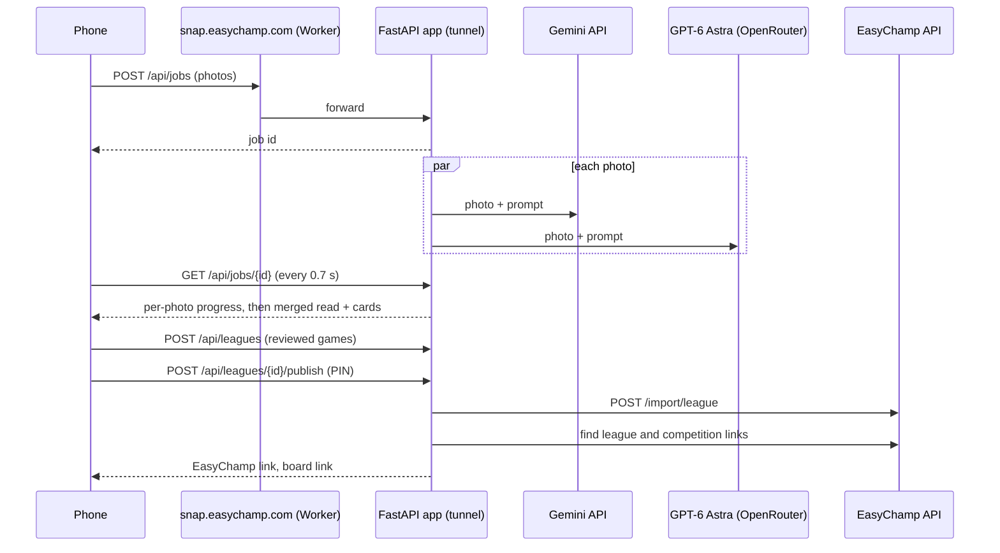

# Architecture

## Pieces

- **Readers** (`app/extract.py`). Two in parallel: the main reader (default Gemini 3.8 Flash through Google's Gemini API, OpenRouter as fallback) and a second opinion (GPT-6 Astra). The organizer picks the main reader. Photos are turned upright from phone EXIF data and capped at 1,600 px before reading.
- **Jobs** (`app/jobs.py`). A thread pool reads up to four photos at once; each photo reports its own status. When all are read, they are merged, checked and, for an existing league, reviewed against it.
- **Storage** (`app/store.py`). JSON files in `data/`, or MongoDB Atlas when `MONGODB_URI` is set. Collections: `jobs`, `snaps`, `leagues`.
- **EasyChamp** (`app/easychamp.py`). Builds the import payload and publishes with a service token from `EC_TOKEN_CMD`; finds the league site and competition page afterwards.
- **Front end** (`static/`). Plain HTML and ES modules on EasyChamp's Matchday design tokens (`static/tokens.css`, copied from ec-uikit). No build step.
- **Edge** (`edge/`). A Cloudflare Worker on `snap.easychamp.com` forwarding to a Cloudflare Tunnel, with an offline page.

## Models and cost

| Model | Perfect reads (sample photos) | Time | Cost per photo |
|---|---|---|---|
| Gemini 3.8 Flash (Gemini API) | 6/6 | 3-7 s | about $0.005 |
| GLM 5.3 Flash (open weights) | 4/4 | 11 s | $0.001 |
| Claude Sonnet 5 | 6/6 | 9-11 s | $0.018 |
| GPT-6 Astra | 4/6 | 9-10 s | $0.032 |

Main reader plus Astra check is about 4 cents a photo; a season of photos for one league is $1-3.

## On EasyChamp

The same pieces map onto the EasyChamp platform: the reader and checks become an endpoint in ec-chat-api (which already reads FC26 stat screenshots), the review screen becomes "Import from photo" in ec-console-ui, and publishing uses the same `POST /import/league`. Signed-in organizers would keep their import history in their account; guests keep using the public page.
