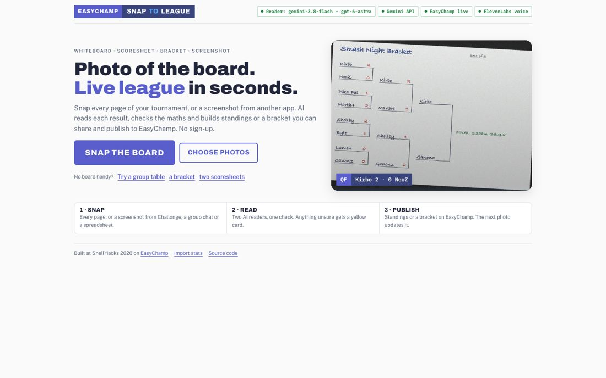
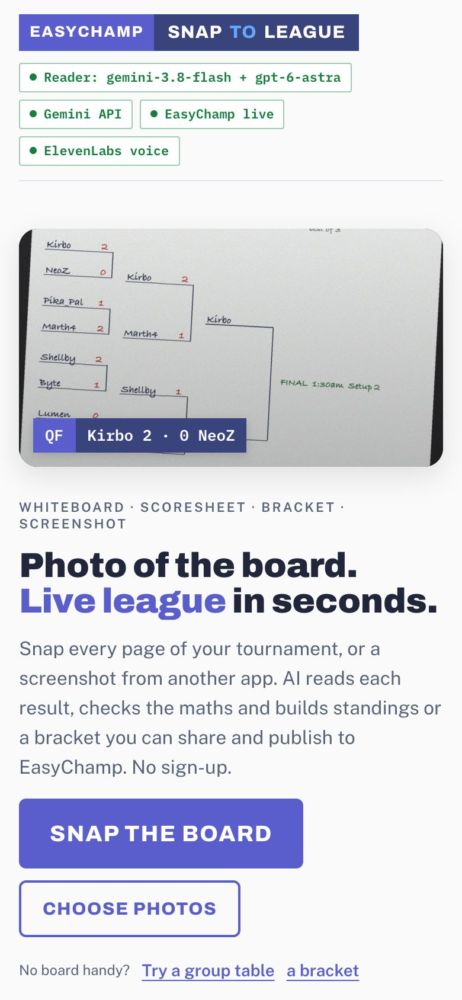
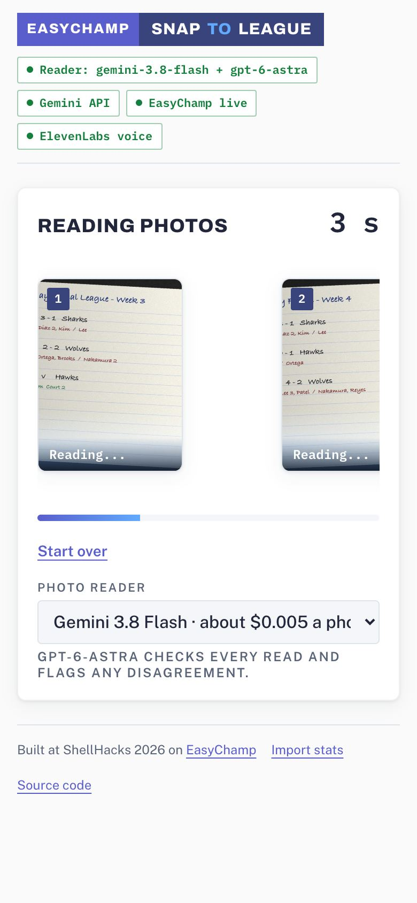
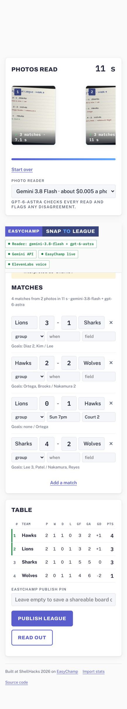
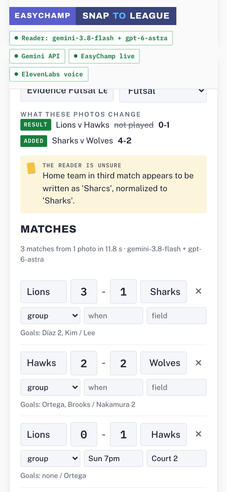
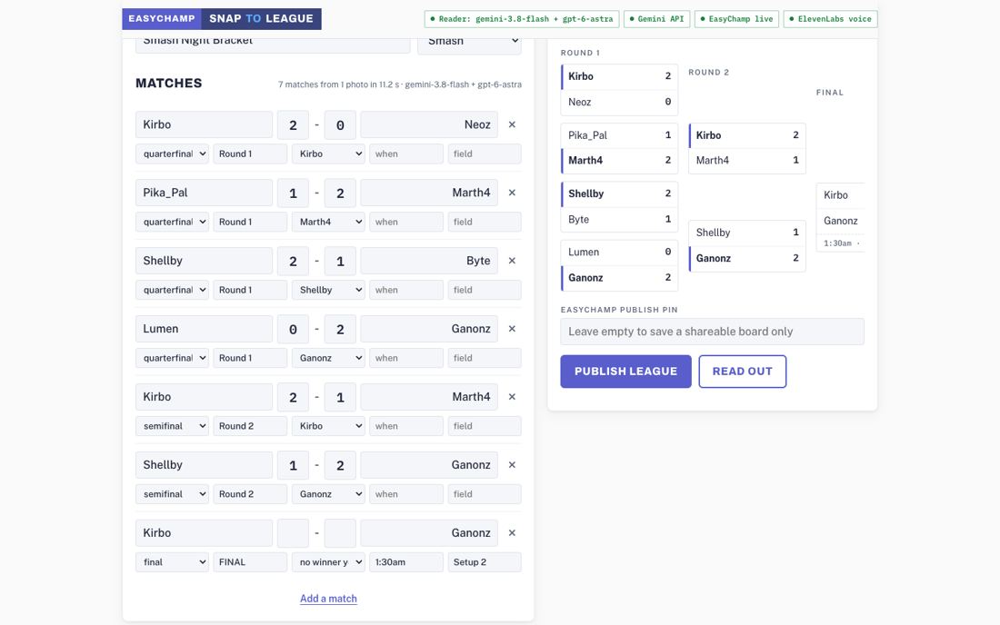
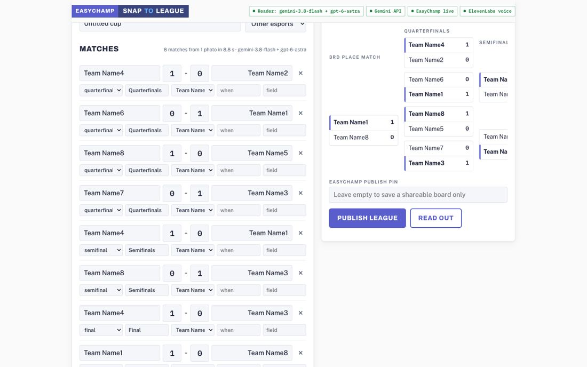
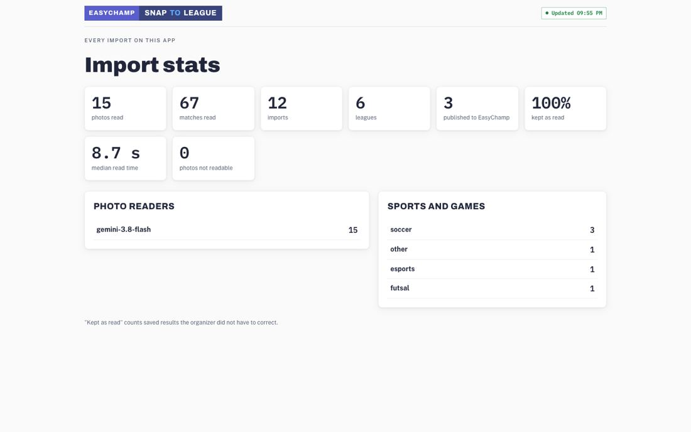

# Evidence

Screenshots were taken headless from the running app (`scripts/capture_evidence.py`); nothing was published to EasyChamp while capturing. Real-platform accuracy comes from `scripts/eval_external.py`, scored against each page's HTML (`tests/fixtures/external/eval-results.json`).

| | |
|---|---|
| Home, desktop |  |
| Photo strip and reading progress |   |
| Two scoresheets merged: 4 games, scorers, "Sharcs" flagged |  |
| A newer photo shows what it changed |  |
| Bracket review |  |
| Challonge screenshot read: 8 of 8 |  |
| Import stats |  |

## Other platforms

| Screenshot | Truth | Read correctly |
|---|---|---|
| Challonge bracket | 8 results | 8 |
| start.gg pool | 22 results | 20 |
| Score7 groups | 6 results | 6 |
| Score7 knockout, phone width | 3 results | 3 |
| start.gg standings | 14 rows | 14, in order |
| LeagueRepublic table | 16 rows | 16, in order |
